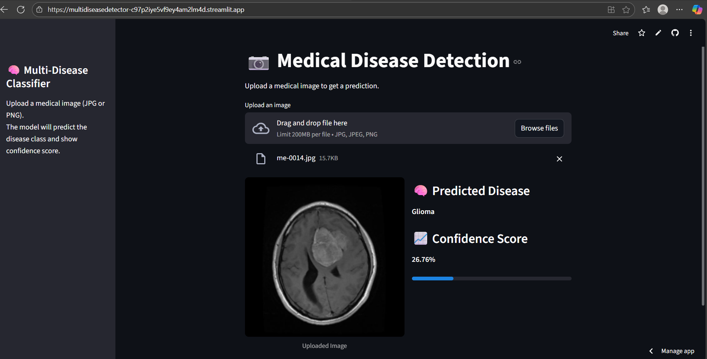

# 🧠 Multi-Disease Medical Image Classifier

This project is a full-stack medical image classifier built with TensorFlow and Streamlit. It predicts one of seven disease classes from uploaded medical images using a trained CNN model.

## 🔍 Features
- Upload medical images (JPG/PNG)
- Real-time disease prediction
- Confidence score with progress bar
- Clean, scroll-free web interface

## 🧪 Supported Classes
- Benign
- Malignant
- Glioma
- Meningioma
- Notumor
- Pituitary
- Pneumonia

## 🚀 How to Run Locally
1. Clone the repo:
   ```bash
   git clone https://github.com/your-username/multi_disease_detector.git
   cd multi_disease_detector
   streamlit run app.py

## 🌐 Live Demo
[Click here to try the app](https://multidiseasedetector-c97p2iye5vf9ey4am2lm4d.streamlit.app/)



